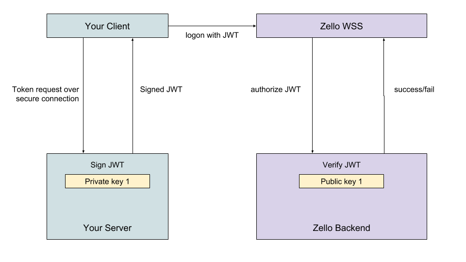

## Channel API Authentication

The Zello channel API relies on the [JWT](https://jwt.io/introduction/) standard
to identify and validate connection requests.

A JWT is nothing more than a header describing the type of token
and the algorithm used to sign it, a payload containing claims, and a signature.

The standard defines a number of possible claims.  We use only two - issuer
and expiration.  For example:

```json
{
  "iss": "Wlc6bWVzaDox.XEMJKRXHmlunNhsyUswNBG/Kh1GZ7qxChIWyHWGgehc=",
  "exp": 1520623595
}
```

JWTs for the Zello WSS use RSA encryption (`"typ": "RS256"`) and so must be signed by a private key.

Both the issuer and the private key are available through the key management tools
in the [developer portal](https://developers.zello.com).  If you are building a client
for the ZelloWork WSS, you can manage keys through your admin console.

Because your private keys must remain private at all times, you should implement 
token generation on the server side, passing newly created tokens only to your authorized
clients, which in turn will pass them to the Zello channel API.



Once you have a generated token, pass it in the `jwt` field of the WSS logon request:

```json
{
  "command": "logon",
  "seq": 1,
  "jwt": "[your token value here]",
  "channel": "suka channel"
}
```

The token must be present in addition to any username/password, ie:

```json
{
  "command": "logon",
  "seq": 1,
  "jwt": "[your token value here]",
  "username": "[zello username]",
  "password": "[zello password]",
  "channel": "suka channel"
}
```

We have included sample code demonstrating how to create JWTs in [PHP](php),
[node JS](js), and [golang](go).